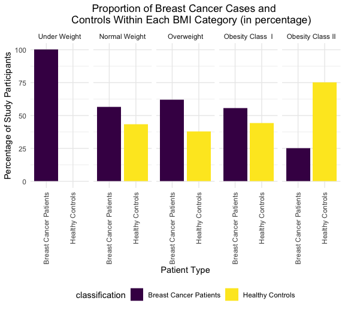

Machine Learning\_hw1\_jf3354
================
Judy Fordjuoh
January 21, 2022

    ## ── Attaching packages ─────────────────────────────────────── tidyverse 1.3.1 ──

    ## ✓ ggplot2 3.3.5     ✓ purrr   0.3.4
    ## ✓ tibble  3.1.5     ✓ dplyr   1.0.7
    ## ✓ tidyr   1.1.3     ✓ stringr 1.4.0
    ## ✓ readr   2.0.1     ✓ forcats 0.5.1

    ## ── Conflicts ────────────────────────────────────────── tidyverse_conflicts() ──
    ## x dplyr::filter() masks stats::filter()
    ## x dplyr::lag()    masks stats::lag()

## QUESTION 1

``` r
#Task: Construct a table providing summaries of the quantitative features of the dataset. Summaries should include the mean, median, minimum value, and maximum value. If you are unable to construct a formatted table within R, you can print raw output, but then comment the output to identify the answer that was requested.

bcdata = read_csv("bcdata_Assignment1.csv") %>%
    janitor::clean_names()
```

    ## Rows: 116 Columns: 10

    ## ── Column specification ────────────────────────────────────────────────────────
    ## Delimiter: ","
    ## dbl (10): Age, BMI, Glucose, Insulin, HOMA, Leptin, Adiponectin, Resistin, M...

    ## 
    ## ℹ Use `spec()` to retrieve the full column specification for this data.
    ## ℹ Specify the column types or set `show_col_types = FALSE` to quiet this message.

``` r
summary(bcdata)
```

    ##       age            bmi           glucose          insulin      
    ##  Min.   :24.0   Min.   :18.37   Min.   : 60.00   Min.   : 2.432  
    ##  1st Qu.:45.0   1st Qu.:22.97   1st Qu.: 85.75   1st Qu.: 4.359  
    ##  Median :56.0   Median :27.66   Median : 92.00   Median : 5.925  
    ##  Mean   :57.3   Mean   :27.58   Mean   : 97.79   Mean   :10.012  
    ##  3rd Qu.:71.0   3rd Qu.:31.24   3rd Qu.:102.00   3rd Qu.:11.189  
    ##  Max.   :89.0   Max.   :38.58   Max.   :201.00   Max.   :58.460  
    ##       homa             leptin        adiponectin        resistin     
    ##  Min.   : 0.4674   Min.   : 4.311   Min.   : 1.656   Min.   : 3.210  
    ##  1st Qu.: 0.9180   1st Qu.:12.314   1st Qu.: 5.474   1st Qu.: 6.882  
    ##  Median : 1.3809   Median :20.271   Median : 8.353   Median :10.828  
    ##  Mean   : 2.6950   Mean   :26.615   Mean   :10.181   Mean   :14.726  
    ##  3rd Qu.: 2.8578   3rd Qu.:37.378   3rd Qu.:11.816   3rd Qu.:17.755  
    ##  Max.   :25.0503   Max.   :90.280   Max.   :38.040   Max.   :82.100  
    ##      mcp_1         classification 
    ##  Min.   :  45.84   Min.   :1.000  
    ##  1st Qu.: 269.98   1st Qu.:1.000  
    ##  Median : 471.32   Median :2.000  
    ##  Mean   : 534.65   Mean   :1.552  
    ##  3rd Qu.: 700.09   3rd Qu.:2.000  
    ##  Max.   :1698.44   Max.   :2.000

For the age category, the minimum age in the dataset is 24 years, the
median is 56 years, the average age (mean) is 57.3 years, and the
maximum age in this data set is 89 years. In the BMI category,the lowest
BMI in the dataset is 18.37 kg/m2, the median BMI is 27.66 kg/m2, the
average BMI is 27.58 kg/m2, and the highest BMI in this data set is
38.58 kg/m2. As for glucose, the lowest glucose level is 60.0 mg/dL, the
median is 92.00 mg/dL, the average glucose level is 97.79 mg/dL, and the
maximum glucose level in this dataset is 201.00 mg/dL. The lowest
insulin level is 2.432 μU/mL, the median is 5.925 μU/mL, the average
level is 10.012 μU/mL, and the maximum insulin level is 58.460 μU/mL.
The lowest result from the homeostatic model assessment was 0.4674, the
median was 1.3809, the mean was 2.6950, and the maxium result in this
dataset was 25.0503. The lowest level of leptin was 4.311 ng/mL, the
median was 20.271 ng/mL, the average level was 26.615 ng/mL, and the
maximum level of leptin in this dataset was 90.280 ng/mL. The lowest
level of adiponectin was 1.656 μg/mL, the median was 8.353 μg/mL, the
average level was 10.181 μg/mL, and the maximum level of adiponectin in
this dataset was 38.040 μg/mL. The lowest level of resistin was 3.210
ng/mL, the median was 10.828 ng/mL, the average level was 14.726 ng/mL,
and the maximum level of resistin in this dataset was 82.100 ng/mL. The
lowest chemokine level (MCP-1) was 45.84 pg/dL, the median was 471.32
pg/dL, the average level was 534.65 pg/dL, and the maximum chemokine
level in this dataset was 1698.44 pg/dL. Since the classification labels
is only two levels (1= controls and 2= breast cnacer patients), the
minimium = 1, the maximum =2, mean = 1.552, and the median = 2. Since
the classification labels is mainly used to group the patients, this
descriptive explaniation of this variable may not be as useful.

## QUESTION 2

``` r
#Task: Recode BMI into the WHO-defined categories below: Severely underweight - BMI less than 16.5kg/m^2, Underweight - BMI under 18.5 kg/m^2, Normal weight - BMI greater than or equal to 18.5 to 24.9 kg/m^2, Overweight – BMI greater than or equal to 25 to 29.9 kg/m^2, Obesity class I – BMI 30 to 34.9 kg/m^2, Obesity class II – BMI 35 to 39.9 kg/m^2, Obesity class III – BMI greater than or equal to 40 kg/m^2. 

#Note to self: there is no severely underweight in this data set
 
#Note to self: regrouping the BMI, referred to DS midterm

bcdata = bcdata %>%  
  mutate(bmi_category = cut(bmi, breaks = c(0, 16.5, 18.5, 24.9, 29.9, 34.9, 39.9, 50), labels = c("Severely Underweight","Under Weight", "Normal Weight","Overweight","Obesity Class  I","Obesity Class II", "Obesity Class III"))) %>%  
  select(bmi,bmi_category, everything()) 
```

After categorizing the individuals to the respective BMI categories, we
see that there is no study participants in the Severely Underweight and
the Obesity Class III BMI categories.

## QUESTION 3

``` r
#Task: Create a bar chart showing the proportion of breast cancer cases and controls within each BMI category

#Note to self: referred to DS midterm

dataclean = bcdata %>% 
  mutate(classification = as.character(classification)) %>%
  mutate(classification = recode(classification,
                       "1" = "Healthy Controls",
                       "2" = "Breast Cancer Patients")) %>% 
  group_by(bmi_category, classification) %>%
  summarize( 
    total = n()
    ) 
```

    ## `summarise()` has grouped output by 'bmi_category'. You can override using the `.groups` argument.

``` r
bcdata_graphs <- dataclean %>%
  ggplot(aes(x = classification, y = total, fill = classification)) +
  geom_bar(stat = "identity") +
  scale_fill_viridis_d() +
  facet_grid(~bmi_category) +
  labs(
    title = "Proportion of Breast Cancer Cases and 
    Controls Within Each BMI Category",
    x = "Patient Type",
    y = "Distribution of Study Participants"
  ) + theme(axis.text.x = element_text(angle = 90, vjust = 0.5, hjust = 1)) + theme(plot.title = element_text(hjust = 0.5)) + theme(legend.position = "bottom")

bcdata_graphs
```



We see that in the underweight category, there is only one breast cancer
patient and no healthy controls. For the Normal Weight, Overweight, and
Obesity Class I categories, the breast cancer patients surpass the
healthy controls. In the Obesity Class II group, there are more health
controls in comparison to the breast cancer patients. There were no
participants in the severly underweight and obesity class III group
which was reflected in the graphs.

To Do: make comments on the graph and message professor asking if she
wants the number of patients and controls are within each bmi catgory

## QUESTION 4

``` r
# Construct a logistic regression model using breast cancer classification as the outcome and glucose, HOMA-IR, leptin, BMI (continuous) and age as the independent variables. Fill in the beta estimate and 95% confidence interval associated with a 1-unit change in HOMA-IR

bc = bcdata %>% 
mutate(classification = as.factor(classification)) 

logistic = glm(classification ~ glucose + homa + leptin + bmi + age, data = bc, family = binomial()) 
summary(logistic)
```

    ## 
    ## Call:
    ## glm(formula = classification ~ glucose + homa + leptin + bmi + 
    ##     age, family = binomial(), data = bc)
    ## 
    ## Deviance Residuals: 
    ##     Min       1Q   Median       3Q      Max  
    ## -2.2944  -0.8901   0.1308   0.8084   2.1371  
    ## 
    ## Coefficients:
    ##              Estimate Std. Error z value Pr(>|z|)    
    ## (Intercept) -3.626065   2.355177  -1.540 0.123654    
    ## glucose      0.081699   0.023526   3.473 0.000515 ***
    ## homa         0.273882   0.171976   1.593 0.111259    
    ## leptin      -0.008574   0.015783  -0.543 0.586979    
    ## bmi         -0.104261   0.056642  -1.841 0.065668 .  
    ## age         -0.022881   0.014377  -1.592 0.111496    
    ## ---
    ## Signif. codes:  0 '***' 0.001 '**' 0.01 '*' 0.05 '.' 0.1 ' ' 1
    ## 
    ## (Dispersion parameter for binomial family taken to be 1)
    ## 
    ##     Null deviance: 159.57  on 115  degrees of freedom
    ## Residual deviance: 120.81  on 110  degrees of freedom
    ## AIC: 132.81
    ## 
    ## Number of Fisher Scoring iterations: 6

``` r
logistic %>% 
  broom::tidy() %>% 
  mutate(OR = exp(estimate)) %>%
  select(term, log_OR = estimate, OR, p.value) %>% 
  knitr::kable(digits = 3) #The table below summaries the coefficients from the model fit; because logistic model estimates are log odds ratios, we include a step to compute odds ratios as well.
```

| term        | log\_OR |    OR | p.value |
|:------------|--------:|------:|--------:|
| (Intercept) |  -3.626 | 0.027 |   0.124 |
| glucose     |   0.082 | 1.085 |   0.001 |
| homa        |   0.274 | 1.315 |   0.111 |
| leptin      |  -0.009 | 0.991 |   0.587 |
| bmi         |  -0.104 | 0.901 |   0.066 |
| age         |  -0.023 | 0.977 |   0.111 |

``` r
confint.default(logistic, level = 0.95, type = Wald)
```

    ##                   2.5 %      97.5 %
    ## (Intercept) -8.24212634 0.989996709
    ## glucose      0.03558953 0.127807931
    ## homa        -0.06318447 0.610948865
    ## leptin      -0.03950852 0.022360915
    ## bmi         -0.21527746 0.006756429
    ## age         -0.05105921 0.005297301

``` r
#calculating the 95% CI
  #tidy(conf.int = T)
```

HOMA Beta: 0.273882 Interpretation: For every one unit change in the
homeostatic model assessment, the log odds of being a breast cancer
patient increases by 0.274.

Interpretation 2: The log odds of being a breast cancer patient with a
high HOMA level is 0.274 times the log odds of being a breast cancer
patient with a low HOMA level.

HOMA CI: (-0.063, 0.611) We are 95% confident that the log odds of being
a breast cancer patient comparing those with a high HOMA level to those
with a low HOMA level, lies between -0.063 and 0.611.

## QUESTION 5

``` r
#Construct a linear regression model using insulin as the outcome and BMI (continuous), age, and glucose as the independent variables. Fill in the beta estimate and 95% confidence interval associated with a 1-unit change in age.

linear = lm(insulin ~ bmi + age + glucose, data = bcdata)

summary(linear) #this would tell you the call, the residuals, the coefficients, SE, Rsquared and F stat
```

    ## 
    ## Call:
    ## lm(formula = insulin ~ bmi + age + glucose, data = bcdata)
    ## 
    ## Residuals:
    ##     Min      1Q  Median      3Q     Max 
    ## -22.161  -4.359  -2.118   2.124  46.269 
    ## 
    ## Coefficients:
    ##              Estimate Std. Error t value Pr(>|t|)    
    ## (Intercept) -13.49576    5.85941  -2.303   0.0231 *  
    ## bmi           0.14969    0.16382   0.914   0.3628    
    ## age          -0.05402    0.05194  -1.040   0.3005    
    ## glucose       0.22982    0.03752   6.126 1.37e-08 ***
    ## ---
    ## Signif. codes:  0 '***' 0.001 '**' 0.01 '*' 0.05 '.' 0.1 ' ' 1
    ## 
    ## Residual standard error: 8.731 on 112 degrees of freedom
    ## Multiple R-squared:  0.2675, Adjusted R-squared:  0.2479 
    ## F-statistic: 13.64 on 3 and 112 DF,  p-value: 1.207e-07

``` r
broom::tidy(linear) %>%
  select(-std.error, -statistic) %>%
  knitr::kable(digits = 3)
```

| term        | estimate | p.value |
|:------------|---------:|--------:|
| (Intercept) |  -13.496 |   0.023 |
| bmi         |    0.150 |   0.363 |
| age         |   -0.054 |   0.301 |
| glucose     |    0.230 |   0.000 |

``` r
confint.default(linear, level = 0.95, type = Wald)
```

    ##                   2.5 %      97.5 %
    ## (Intercept) -24.9799980 -2.01152050
    ## bmi          -0.1713873  0.47076792
    ## age          -0.1558202  0.04777686
    ## glucose       0.1562895  0.30334627

Age Beta:-0.054

Age CI: (-0.156,0.048)
